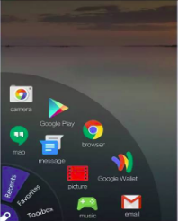
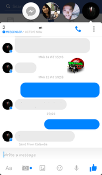

# FLASTO

This project will consist of a standalone android library implementing various features of floating heads (eg: messenger chat head). This library targets those developers who wish to include messenger like features viz chat heads, running foreground tasks , can be accommodated in music players, providing easy and beautiful navigation etc giving programmers the ease of customisation without having to code difficult aspects themselves.

## Features
* A Floating head active in foreground even during the runtime of other application. Will include a setting to disable this function, i.e. for eg: the head will disappear if the parent application is shut down.
* Will be responsive to all types of click events like touch, long press, swipe, etc. Different actions(what is to be done) can be set by users when a particular click event occurs.
* It will include an [expandable menu](#expandable-menu) which can be enabled and customised by the user. The menu's item can be added/removed by the user. For e.g. - A music player app may choose to use this library to show a menu which contains options to pause/play, forward and rewind.
* It will also include an easy way to add [chat heads](#chat-heads) which shows a fragment of user's choice when clicked.

### Expandable Menu

### Chat Heads

## How you can help

* Make us aware of the imperfections and bugs by opening [issues](https://github.com/sdsmdg/flasto/issues)
* Join our [Chat Room](https://mdg.sdslabs.co/chat) and introduce yourself, please ask any general questions here -- how the product is supposed to work, usability issues, technical questions, whatever you want to know, we want to hear about.  If you are interested in collaborating with us, let us know.
* Read our [Contribution Guide](CONTRIBUTING.md) -- everything you do with us is a contribution to the public domain, there are also some tips for getting started
* Dive into our [existing issues](https://github.com/sdsmdg/flasto/issues) -- there are both dev and design opportunities there

## License

FLASTO is registered under MIT License.

For more information, see [license](LICENSE.md).
